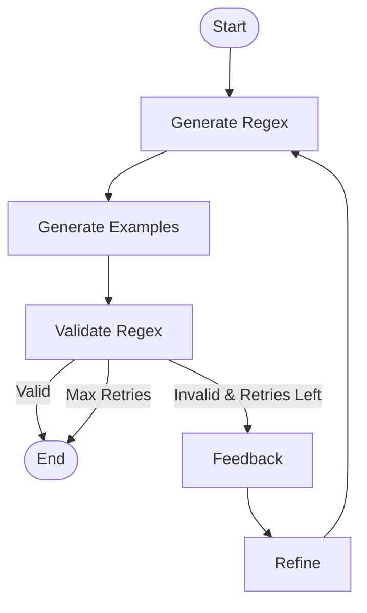

# Regex Agent MVP

A modular, LLM-powered tool for designing, validating, and refining regular expressions with minimal user input. Features a built-in pattern catalog, advanced validation (false positives/negatives), robust batch mode, and workflow visualization.

---

## Table of Contents
- [Requirements](#requirements)
- [Features](#features)
- [Quickstart](#quickstart)
- [Usage](#usage)
- [Batch Mode & CLI Options](#batch-mode--cli-options)
- [Pattern Catalog](#pattern-catalog)
- [Extending the Catalog](#extending-the-catalog)
- [Output](#output)
- [Contributing](#contributing)
- [License](#license)
- [Workflow Diagrams](#workflow-diagrams)

---

## Requirements
- **Python**: 3.9 or 3.10 (see `pyproject.toml`)
- **Dependencies:** (automatically installed via pip)
  - `langgraph>=0.4.10`
  - `pydantic>=2.7.1`
  - `pydantic-ai>=0.3.4`
  - `grandalf>=0.8`
- **Note:** All dependencies are managed via `pyproject.toml` (PEP 517/518). No `requirements.txt` is needed.

---

## Features
- **LLM-Powered Regex Design:** Generate regex patterns and examples from natural language.
- **Self-Validating Workflow:** Auto-generates and validates positive/negative examples, with a feedback/refinement loop.
- **Pattern Catalog:** Uses and checks known patterns for common types (email, phone, date, etc.), loaded from an external JSON file.
- **Advanced Validation:** Reports false positives/negatives and allows user feedback.
- **Batch Mode:** Run many prompts at once, fully non-interactive, with auto-improvement and summary reporting.
- **Visualization:** Prints workflow as ASCII art, Mermaid, and PNG diagrams.
- **Organized Output:** Saves results in the `results/report-YYYY-MM-DD/` folder (JSON, CSV, Markdown).
- **Extensible:** Easily add new patterns to the catalog without changing code.

---

## Workflow Diagrams

The agent first runs the **Clarification/Decomposition Workflow** to interpret and, if needed, clarify the user's request. Once the request is understood and decomposed into one or more pattern tasks, each pattern is processed independently through the **Single-Pattern Workflow**. This modular approach ensures that ambiguous or multi-part requests are handled robustly, and each regex is generated, validated, and refined as needed.

### Clarification/Decomposition Workflow


### Single-Pattern Workflow


---

## Quickstart
1. **Install dependencies** (requires Python 3.9+):
   ```bash
   pip install -e .
   ```
   This uses `pyproject.toml` to resolve and install all dependencies.
2. **Set up your `.env` file:**
   ```env
   OPENAI_API_KEY=sk-...
   MODEL_NAME=gpt-3.5-turbo
   ```
3. **Run the tool (interactive):**
   ```bash
   python3 main.py
   ```
4. **Run in batch mode (non-interactive, summary only):**
   ```bash
   python3 main.py --prompt-file examples.txt --non-interactive --verbose
   # For quiet summary only (recommended for CI):
   python3 main.py --prompt-file examples.txt --non-interactive
   ```

---

## Usage
- **Describe your regex need** in natural language when prompted (interactive mode).
- **Batch mode:** Use `--prompt-file` with a file containing one prompt per line (e.g., `examples.txt`).
- **Non-interactive mode:** Use `--non-interactive` to disable all user prompts. The agent will auto-improve and never block for input.
- **Verbose mode:** Use `--verbose` to see all intermediate output. Omit for a concise summary table only.
- **Review results** in the console and in the `results/report-YYYY-MM-DD/` folder.

---

## Batch Mode & CLI Options
- `--prompt-file <file>`: Run all prompts in the file (one per line).
- `--non-interactive`: Never prompt for user input. The agent will auto-improve (regenerate examples, clarify description) up to 3 times if needed.
- `--verbose`: Show all intermediate output (status, tables, agent messages). Omit for only the initial and final summary table.

**Example:**
```bash
python3 main.py --prompt-file examples.txt --non-interactive
```
- In non-verbose mode, you get a summary table with: prompt, regex, and status (valid/invalid) for each pattern.

---

## Pattern Catalog
- The pattern catalog is stored in [`pattern_catalog.json`](pattern_catalog.json).
- The agent will use catalog patterns if available, and auto-validate them.

---

## Extending the Catalog
- Add new patterns to `pattern_catalog.json` with positive and negative examples.
- No code changes required—just update the JSON file.

---

## Output
- All results are saved in a timestamped subdirectory under `results/`.
- Output includes:
  - `results.json`: Full results for all patterns.
  - `results.csv`: Tabular results for easy review.
  - `report.md`: Markdown summary report.
- In non-verbose mode, a summary table is printed to the console for each prompt.

---

## Contributing
- **Pull requests welcome!**
- Please add tests for new features or patterns.
- For new catalog entries, provide at least 2 positive and 2 negative examples.
- See [pattern_catalog.json](pattern_catalog.json) for format.

---

## License
MIT
