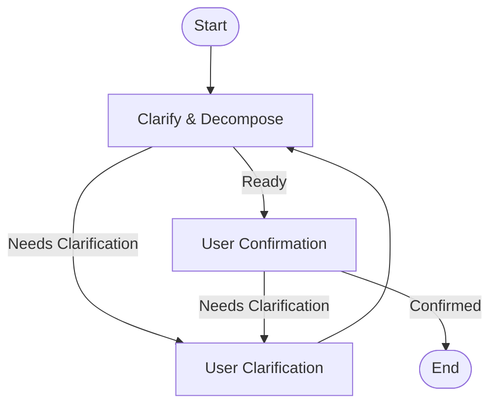

# Regex Agent MVP

A modular, LLM-powered tool for designing, validating, and refining regular expressions with minimal user input. Features a built-in pattern catalog, advanced validation (false positives/negatives), and workflow visualization.

## Features
- **LLM-Powered Regex Design:** Generate regex patterns and examples from natural language.
- **Self-Validating Workflow:** Auto-generates and validates positive/negative examples, with a feedback/refinement loop.
- **Pattern Catalog:** Uses and checks known patterns for common types (email, phone, date, etc.).
- **Advanced Validation:** Reports false positives/negatives and allows user feedback.
- **Visualization:** Prints workflow as ASCII art, Mermaid, and PNG diagrams.
- **Organized Output:** Saves results in the `results/` folder (JSON, CSV).

## Workflow Diagrams

The agent first runs the **Clarification/Decomposition Workflow** to interpret and, if needed, clarify the user's request. Once the request is understood and decomposed into one or more pattern tasks, each pattern is processed independently through the **Single-Pattern Workflow**. This modular approach ensures that ambiguous or multi-part requests are handled robustly, and each regex is generated, validated, and refined as needed.

### Clarification/Decomposition Workflow


### Single-Pattern Workflow


## Quickstart
1. **Install dependencies** (requires Python 3.8+):
   ```bash
   pip install -e .
    ```
2. **Set up your `.env` file:**
   ```env
   OPENAI_API_KEY=sk-...
   MODEL_NAME=gpt-3.5-turbo
   ```
3. **Run the tool:**
   ```bash
   python3 main.py
   ```

## Output
- Results: `results/results.json`, `results/results.csv`
- Workflow diagrams: `images/` (PNG, ASCII, Mermaid)

## Dependencies
- [LangGraph](https://github.com/langchain-ai/langgraph)
- [OpenAI Python SDK](https://github.com/openai/openai-python)
- [Pydantic](https://docs.pydantic.dev/)
- [python-dotenv](https://pypi.org/project/python-dotenv/)

## License
MIT
